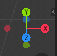

github.com/williamjiamin
lexueoude.com
class.lexueoude.com

# 2.Coordinate System

## 2.1 WebGLRender (we got x y z axis)

we are using the EUS ( x axis points east y axis point up , and z axis point south)
